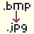

# bmp2jpg-3DS
  
a 3ds homebrew application for converting bitmaps to jpgs  
**New3DS systems are currently untested so milage may vary**

# Usage
1. pick the bmp you want to convert to a jpg on the bottom screen
2. Wait until the application says "Conversion successful!"
3. Press A to go back to the file picker
4. Repeat from 1. until satisfied (optional)
5. Press start to return to the hb menu
6. Go back to the directories where you picked the files and you should see a copy of them as a jpg

# Building
- devkitpro-3ds
- make

1. download and setup [devkitpro](https://devkitpro.org/wiki/Getting_Started) (you want the 3ds-dev packages)
2. git clone this repo
3. run `make`
4. move the bmp2jpg.3dsx file to `3ds/` on your SD card or run `3ds-link -a <3ds IP Addr> bmp2jpg.3dsx` after you pressed `Y` on the homebrew launcher while connected to the internet

# Patch Notes
## v1.1.0
- fixed known dimmed screen bug via rewriting the UI
- made an icon for the app
- app no longer closes after converting 1 bitmap
- you can now hold up or down to scroll instead of needing to spam
- app is now in dark mode by default

## v1.0.0
- inital version

# Roadmap
- [ ] re-add light mode

# Known Bugs
- [x] ~~the screen being very dim~~  
    ~~workaround: turn brightness to max~~